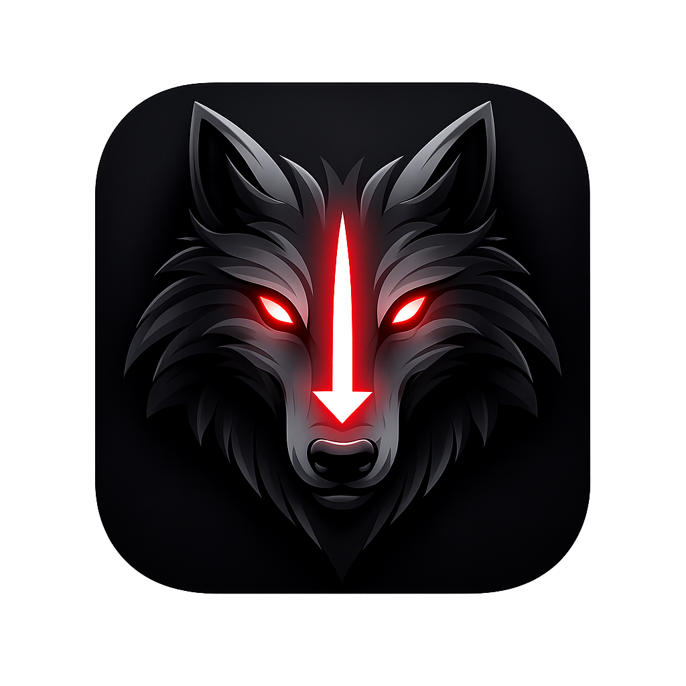

<p align="center">
  
</p>

<h1 align="center">🐺 Wolfy's Media Downloader</h1>
<p align="center">
  <b>V2.0</b> — A clean, expandable media downloader for YouTube, Spotify, and more.<br/>
  Built with Python, CustomTkinter, yt-dlp and SpotDL.
</p>

<p align="center">
  
  
  
  
</p>

---

## ✨ Features

- **Tabbed GUI** — Download, Queue, History, Settings — all in one clean window
- **Download Queue** — Add multiple URLs, they run one by one with live progress bars
- **Spotify Support** — Full track, album and playlist downloads via SpotDL
- **YouTube & Generic** — yt-dlp powers everything else (YouTube, SoundCloud, etc.)
- **Multiple Formats** — MP3 (320kbps), FLAC (lossless), MP4, MKV
- **Auto Dependency Check** — Detects missing deps on startup and offers to install them
- **Failsafe Error Handling** — Spotify rate limits surface as readable errors with fix instructions
- **Dev Mode** — Hidden debug tab with live logs, config dump, raw command runner
- **CLI Fallback** — Full CLI mode if GUI isn't available or `--cli` flag is used
- **Persistent Config** — Remembers your settings, history (last 100 downloads), and preferences

---

## 🚀 Quick Start

### Requirements

- Python 3.13+
- [uv](https://docs.astral.sh/uv/) package manager
- FFmpeg in PATH — [download here](https://ffmpeg.org/download.html) or `winget install ffmpeg`
- [Deno](https://deno.com) — JS runtime required by yt-dlp for YouTube signature solving

### Run from Source

```bash
git clone https://github.com/wolfy213/wolfys-media-downloader.git
cd wolfys-media-downloader

uv sync
uv run main.py
```

### CLI Mode

```bash
# Interactive
uv run main.py --cli

# Direct
uv run main.py --cli --url "https://youtube.com/..." --dest "C:/Music" --format mp3
```

---

## 🏗️ Build Standalone .exe

```bash
# Install PyInstaller
uv pip install pyinstaller

# Build (Windows)
build.bat

# Or manually
uv run pyinstaller WolfysMediaDownloader.spec --noconfirm
```

Output: `dist/WolfysMediaDownloader.exe`

> **Note on Windows SmartScreen:** The exe embeds full version metadata (company, product name, copyright) which reduces SmartScreen warnings. For full trust without warnings, the exe would need to be code-signed with a paid certificate. This is an open-source project — the source code is fully auditable.

---

## 🎵 Spotify Setup

SpotDL uses Spotify's API to look up track metadata before downloading. By default it uses shared credentials which have a rate limit shared across all SpotDL users.

**To avoid rate limits (recommended):**

1. Go to [developer.spotify.com](https://developer.spotify.com) → Create an app (free)
2. Copy your **Client ID** and **Client Secret**
3. Open Settings → Spotify API Credentials and paste them in

Your credentials are stored locally in `%APPDATA%\WolfysMediaDownloader\config.json` and never shared.

---

## 📁 Project Structure

```
wolfys-media-downloader/
├── main.py                       # Entry point
├── pyproject.toml                # uv/pip dependencies
├── WolfysMediaDownloader.spec    # PyInstaller build spec
├── version_info.txt              # Windows exe metadata
├── build.bat                     # One-click build script
├── LICENSE                       # GNU GPL v3
├── Wolfysdownloaderlogo.png      # App logo
├── Wolfysdownloaderlogo.ico      # App icon (exe/taskbar)
├── core/
│   ├── config.py                 # Persistent settings manager
│   ├── deps.py                   # Dependency checker + auto-installer
│   ├── downloader.py             # yt-dlp + SpotDL download logic
│   ├── queue_manager.py          # Thread-safe download queue
│   └── cli.py                    # CLI fallback mode
└── gui/
    ├── app.py                    # Main window + theme
    ├── dep_dialog.py             # Dependency installer dialog
    └── tabs/
        ├── download_tab.py       # URL input + add to queue
        ├── queue_tab.py          # Live queue with progress bars
        ├── history_tab.py        # Download history (last 100)
        ├── settings_tab.py       # Theme, defaults, Spotify creds, deps
        └── dev_tab.py            # Developer mode tab (hidden by default)
```

---

## ⚙️ Supported Formats

| Format | Source          | Quality                        |
|--------|-----------------|--------------------------------|
| MP3    | YouTube/generic | 320kbps, metadata + thumbnail  |
| FLAC   | YouTube/generic | Lossless                       |
| MP4    | YouTube/generic | Best available video           |
| MKV    | YouTube/generic | Best available video           |
| MP3    | Spotify         | Via SpotDL                     |

---

## 🔧 YouTube PO Tokens

If YouTube starts blocking downloads, you may need a PO token. Enter it in the Download tab — it gets saved automatically.

Guide: [yt-dlp PO Token Guide](https://github.com/yt-dlp/yt-dlp/wiki/PO-Token-Guide)

---

## 🛠️ Developer Mode

Enable in Settings → Developer Mode (restart required). Adds a **Dev** tab with:

- Live application log with level selector
- Current config dump (secrets redacted)
- Dependency version info
- Raw command runner

---

## 📄 License

GNU General Public License v3.0 — see [LICENSE](LICENSE) for full text.

This software is free and open source. You may redistribute and modify it under the terms of the GPL v3.

---

## ⚠️ Disclaimer

This tool is for personal use only. Respect copyright laws and the terms of service of any platform you download from. The developers are not responsible for misuse.
